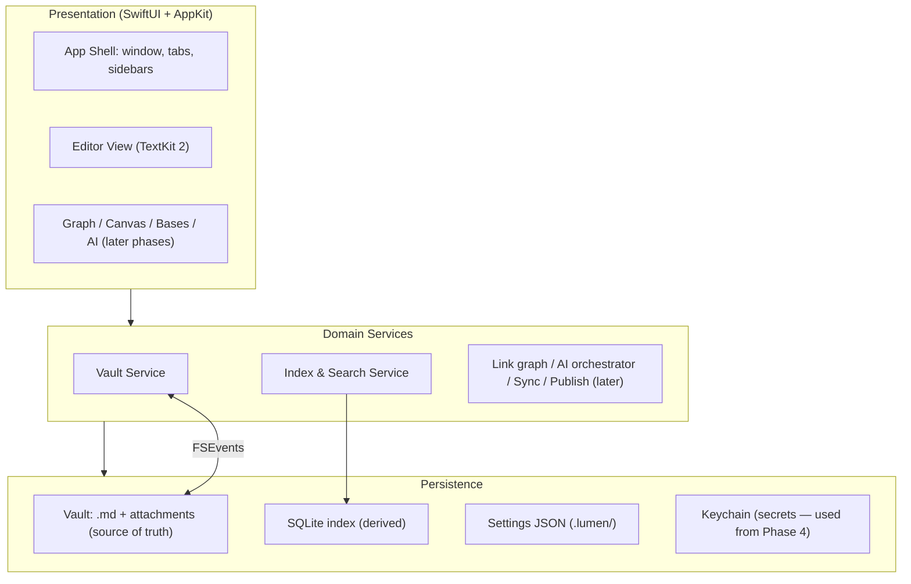

# Phase 1 — Foundations & Basic Markdown Editor (MVP)

> Depends on: nothing. This is the base every later phase extends.

## Goal / Outcome

A **fast, native, good-looking Markdown editor** you'd actually want to write in:

- Open a folder as a vault and browse its files in a sidebar.
- Open, edit, and save `.md` files reliably.
- A clean, calm, dark-by-default UI with tabs and a status bar.

That's it. **No live preview, no wikilinks, no graph, no AI.** The point of Phase 1 is to ship a solid, pleasant plain-Markdown editor and — just as importantly — to stand up the architecture, the package structure, and the data model that everything else will build on.

---

## In scope (basic functionality only)

**Vault**
- Choose a folder as the vault; remember recent vaults; reopen the last vault on launch.
- Security-scoped bookmark so the folder stays accessible (works toward a sandboxed build later).

**File tree**
- Sidebar showing folders and `.md` files (attachments shown but greyed for now).
- Basic file operations: new note, new folder, rename, delete (to Trash), reveal in Finder.
- Sort by name / modified date.

**Editor**
- `NSTextView` backed by **TextKit 2** for performant, viewport-based layout in large documents.
- Open / edit / save; **autosave** with debounce + write-on-blur; undo/redo.
- **Lightweight Markdown syntax highlighting** only — headings, bold/italic, inline code, fenced code, links, list markers shown with color/weight. (This is *highlighting*, not the inline WYSIWYG rendering — that's Phase 2.)
- Monospace and proportional font options; adjustable line width and spacing.

**Tabs & window**
- Tabbed editor (open several notes); close/reorder tabs; restore open tabs on relaunch.
- One window for now (multi-window and split panes come in Phase 3).

**External edits**
- **FSEvents** watching: if a file changes on disk and has no unsaved edits, reload it. (Full conflict resolution is Phase 3 — for now, warn before overwriting a file that changed underneath unsaved edits.)

**UI shell**
- Layout: collapsible left sidebar (file tree) · center editor + tab bar · slim bottom status bar.
- Refined **dark theme** by default, plus light and system options; a single configurable accent color.
- Status bar: word/character count, save state, indexing indicator.

**Settings**
- Per-vault config written as human-readable JSON in `.lumen/`.
- Theme toggle, font, default new-note location.

---

## Out of scope (deferred — noted so Phase 1 stays small)

| Deferred | Lands in |
|---|---|
| Live Preview / inline WYSIWYG rendering, reading view, math, Mermaid | Phase 2 |
| Slash commands, multi-cursor, regex find/replace, folding, vim mode | Phase 2 |
| Wikilinks, backlinks, embeds, properties editor, tags, command palette, search, graph, daily notes | Phase 3 |
| AI (suggestions, brainstorm, chat, web search) | Phase 4 |
| Canvas, Bases | Phase 5 |
| Sync, Publish, plugins/themes platform, deep macOS integration | Phase 6 |

---

## Architecture foundation

This is the architectural groundwork the rest of the project builds on. Set it up correctly now; later phases mostly add packages and views rather than reshaping this.

### Layering principle

The **vault (files) is the source of truth; everything else is derived and rebuildable.** The app must never require its database to read or write user content. Deleting `.lumen/` should lose only caches and local preferences — never notes.

### High-level architecture

Boxes shown dimmed conceptually below come online in later phases; Phase 1 implements the Presentation shell, the Vault/Index services, and the Persistence layer.

### Technology stack

Phase 1 implements the rows marked **P1**; the rest are wired in their phases but the choices are fixed now so the foundation is right.

| Layer | Choice | Phase | Notes |
|---|---|---|---|
| Language | **Swift 6** (strict concurrency) | P1 | Actors for indexing/IO; `@MainActor` UI. |
| App shell / chrome | **SwiftUI** + **AppKit** interop | P1 | SwiftUI for layout; AppKit (`NSViewRepresentable`) where needed. |
| Text editor | **TextKit 2** (`NSTextView` + `NSTextLayoutManager`) | P1 | Viewport-based layout for large docs. |
| Metadata index & search | **SQLite** via **GRDB.swift**, **FTS5** | P1 (notes table) / P3 (FTS, links) | Derived cache, not source of truth. |
| YAML frontmatter | **Yams** | P1 (parse) / P3 (editor) | Properties parsing/serialization. |
| File watching | **FSEvents** | P1 | Detect external edits. |
| Settings | JSON / `UserDefaults` | P1 | Human-readable per-vault config. |
| Incremental parsing / highlighting | **tree-sitter** (markdown grammar) | P2 | Fast incremental reparse on edit. |
| Full-doc Markdown → AST/HTML | **swift-markdown** (cmark-gfm) | P2 | Reading view, Publish export. |
| Math / Diagrams | **SwiftMath** + KaTeX / **Mermaid** (sandboxed WebView) | P2 | Cached as images. |
| Vector search | **sqlite-vec** | P4 | Embeddings for semantic recall. |
| Graph & canvas | **Metal** (+ optional SpriteKit) | P3 / P5 | Force-directed layout on a background actor. |
| On-device AI | **MLX Swift** / **Core ML** / Foundation Models | P4 | Local inference + embeddings. |
| Cloud AI | Pluggable provider layer (user keys) | P4 | Streaming, tool/function calling. |
| Secrets | **Keychain** + **CryptoKit** | P4 / P6 | API keys, sync keys, E2E encryption. |

**Targets:** macOS 14 Sonoma minimum (15 Sequoia recommended). Apple Silicon-optimized, Universal binary. Notarized Developer ID `.app` with an optional sandboxed Mac App Store build later.

### Module breakdown (Swift Package Manager workspace)

Built as a multi-package SPM workspace so each subsystem compiles, tests, and evolves independently. **Phase 1 creates `LumenCore`, `LumenEditor`, `LumenDesignSystem`, and `LumenApp`**; the others are created as empty package stubs now (so the wiring is in place) and filled in their phases.

| Package | Responsibility | Created in |
|---|---|---|
| `LumenCore` | Vault model, file IO, FSEvents, frontmatter, the SQLite index, search. The non-UI heart. | **P1** |
| `LumenEditor` | TextKit 2 editor; (P2) tree-sitter highlighting, live preview, math/diagram attachments. | **P1** (basic) |
| `LumenDesignSystem` | Tokens (color, type, spacing), theming engine, shared SwiftUI components, icons. | **P1** |
| `LumenApp` | The macOS app target: window, menus, settings, dependency wiring. | **P1** |
| `LumenGraph` | Graph data structures, force-directed layout, Metal renderer. | P3 |
| `LumenAI` | Providers, embeddings, retrieval, orchestrator, tools, suggestion/brainstorm/chat engines. | P4 |
| `LumenCanvas` | Infinite canvas, JSONCanvas read/write, card/edge model, Metal renderer. | P5 |
| `LumenBases` | Query engine over the index, table/board/list views, `.base` format. | P5 |
| `LumenSync` | Diff/encrypt/transport, conflict resolution, version history. | P6 |
| `LumenPublish` | Reading-view → static site renderer, theming, deploy client. | P6 |
| `LumenPlugins` | JS/Wasm sandbox runtime, native extension API, plugin lifecycle. | P6 |

### Data model: the Vault

**Source of truth** — a user-chosen folder containing `*.md` notes (UTF-8, Markdown + optional YAML frontmatter), attachments, (later) `*.canvas` and `*.base` files, and a `.lumen/` config folder.

**Derived index (SQLite via GRDB)** — a rebuildable cache. Phase 1 builds only the `notes` table (path, title, mtime, size, frontmatter snapshot, hash); `links`, `tags`, `headings`, `blocks`, `tasks`, `fts`, and `embeddings` tables are added in Phases 3–4.

**Indexing pipeline (Phase 1 version)**
1. On vault open, enumerate files; compare hashes/mtimes against the cache.
2. For changed files, parse frontmatter + record metadata; update the `notes` row. (Link/tag/heading extraction is added in Phase 3.)
3. **FSEvents** watches the folder and re-indexes affected files with debouncing.
4. All indexing runs on a background `actor` so the UI never blocks; progress shows subtly in the status bar.

### Concurrency, state & performance (set the patterns now)

- **Swift Concurrency throughout:** `async/await`; **actors** isolate the index and IO; UI is `@MainActor`. Strict concurrency checking on.
- **State:** the **Observation** framework (`@Observable`) with SwiftUI; an in-memory Vault store as the working source of truth, backed by files + SQLite. Largely unidirectional data flow.
- **Performance budget (start measuring in Phase 1):** cold launch < 1s on Apple Silicon; open a large vault and type with no perceptible input latency; idle memory a fraction of an Electron equivalent — via viewport-based TextKit 2 layout, lazy loading, and the SQLite index for queries (never scanning files at query time).

---

## Task breakdown

**Project setup**
- [ ] Create the SPM workspace and the four Phase 1 packages; stub the rest.
- [ ] App target (`LumenApp`): window, menu bar, app lifecycle, dependency wiring.
- [ ] Wire CI: build + test + lint on every PR; set up the performance-benchmark harness skeleton.

**Vault & file IO (`LumenCore`)**
- [ ] Vault open/close; recent vaults; security-scoped bookmarks.
- [ ] File enumeration, read/write, atomic saves, Trash deletion, rename, new note/folder.
- [ ] FSEvents watcher with debounce; reload-on-external-change (no-unsaved-edits case).
- [ ] Frontmatter parse (Yams) into a metadata snapshot.

**Index skeleton (`LumenCore`)**
- [ ] GRDB setup; `notes` table + migrations; hash/mtime change detection.
- [ ] Background indexing actor; status-bar progress.

**Editor core (`LumenEditor`)**
- [ ] TextKit 2 `NSTextView` host (`NSViewRepresentable`); open/edit/save binding.
- [ ] Autosave (debounce + write-on-blur); undo/redo.
- [ ] Lightweight Markdown highlighter (regex/line-based for now; tree-sitter comes in Phase 2).
- [ ] Font, line-width, and spacing controls.

**UI shell (`LumenApp` + `LumenDesignSystem`)**
- [ ] Three-region layout: collapsible left sidebar, center editor + tab bar, status bar.
- [ ] File-tree view bound to the vault; basic file-op context menu.
- [ ] Tab bar: open/close/reorder; restore tabs on relaunch.
- [ ] Design tokens (color/type/spacing); dark/light/system theming; accent color.
- [ ] Status bar: word count + save state + indexing indicator.

**Settings**
- [ ] Per-vault JSON config in `.lumen/`; settings UI for theme/font/new-note location.

**QA / testing**
- [ ] Unit tests: file IO, frontmatter parsing, change detection, index updates.
- [ ] UI tests: open vault → open note → edit → save → reopen.
- [ ] Performance test: open a large synthetic vault; measure launch + typing latency + memory.

---

## Definition of done

- A user can open a folder, see their `.md` files, open several in tabs, edit and save them, and reopen the app to the same state.
- External edits to a file with no unsaved changes reload automatically; editing a file changed underneath unsaved edits prompts before overwriting.
- Dark/light/system themes and accent color work; the UI feels calm and native.
- Launch is sub-second and typing has no perceptible latency on a large synthetic vault.
- The SPM workspace, the four core packages, the `notes` index, and CI are all in place.

---

## Risks specific to Phase 1

- **TextKit 2 editor foundation.** Getting performant, viewport-based layout right is the groundwork for the hardest component (live preview, Phase 2). *Mitigation:* validate large-document scrolling/typing performance early; keep the highlighter cheap and incremental-friendly.
- **Scope creep into Phase 2.** It's tempting to start inline rendering now. *Mitigation:* hold the line — Phase 1 ships a plain highlighted editor; WYSIWYG is Phase 2, where the risk is tackled deliberately (with a split edit/preview fallback if needed).
